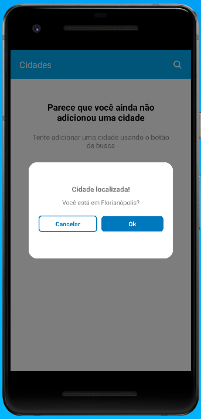
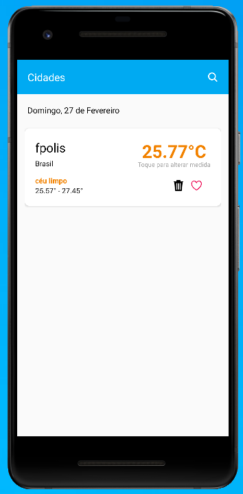
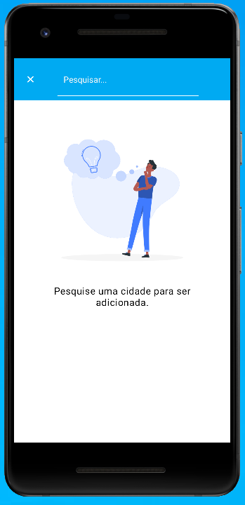
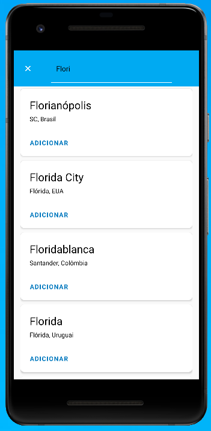
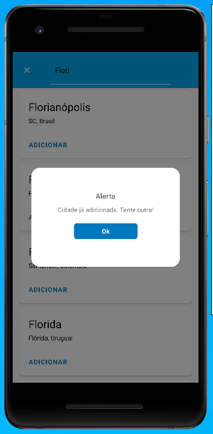
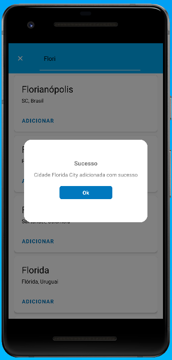
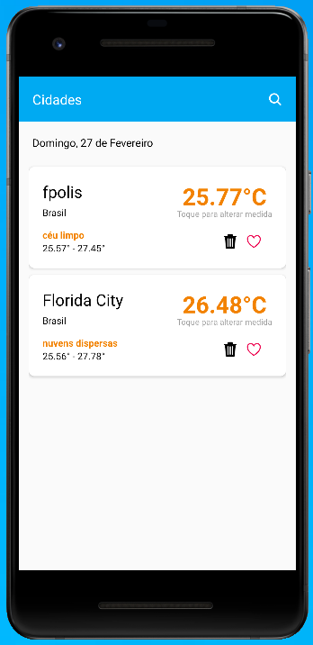
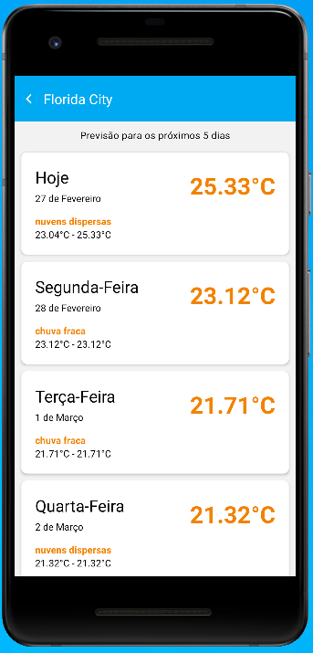

# Weather Forecast App

Aplicativo para previsão do tempo.


## Funcionalidades

- Protótipos: https://zpl.io/boMp3eo

**- Listagem de cidades com a previsão atual**

    - [Extra] Ao acessar o app, ele pega a localização do usuário e mostra a cidade atual caso o usuário confirme    
    - [Extra] Exclusão de cidades
    - [Extra] Ao tocar na temperatura é alterado de Celsius para Fahrenheit
    - [Extra] Favoritar uma ou mais cidades (essas ganham prioridade na listagem)
    - [Extra] Adicionado a data atual na home, antes da listagem

**- Pesquisa e adição de cidades**  

    - Para a pesquisa de cidades foi usado o Google Places API
    - [Extra] Não permite cadastarr cidade já adicionada
    
**- Previsão do tempo para os próximos 5 dias**


## Instalação


```bash
  git clone  
  cd weatherForecastApp
  npm install 

  npm run start
  npm run android
```
    
## Melhorias 

- Foi desenvolvido somente para Android (estava sem Mac) :( 
- Utilizar ContextAPI ou Redux para controlar o estado da aplicação, e nao precisar faze tantas chamadas pro AsyncStorage
- Componentizar algumas coisas, exemplo: header e as cards com a previsão
- Criei a branch somente no final, poderia ter criado mais branches e subindo aos poucos


## Screenshots










## Autores

- [@eduardofinotti](https://github.com/eduardofinotti/)